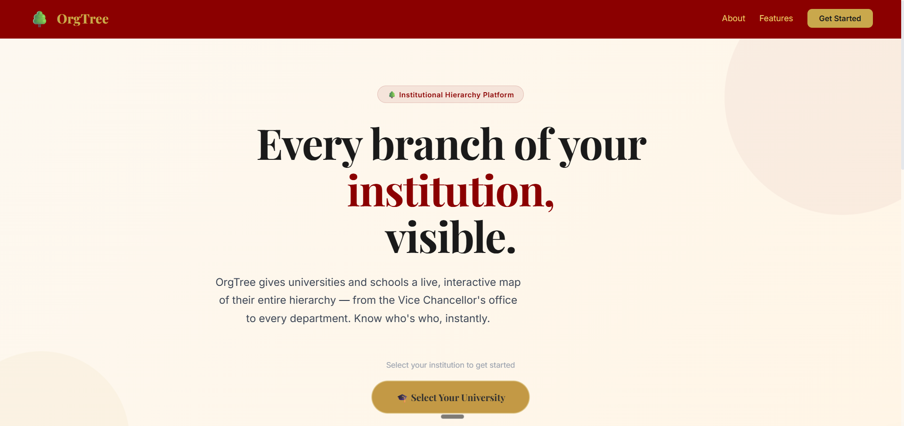
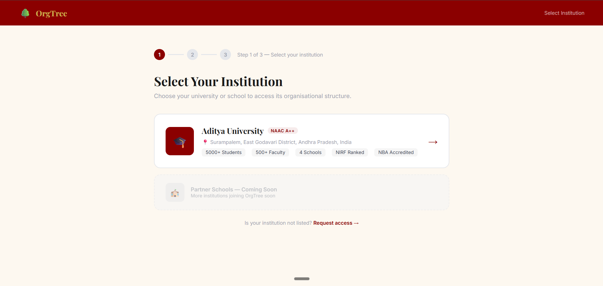
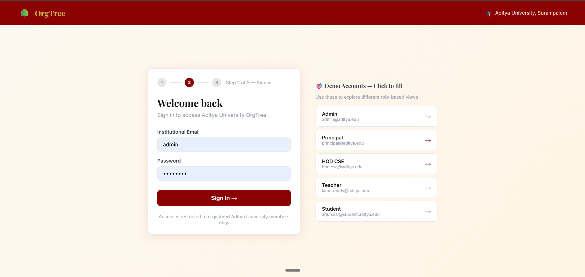
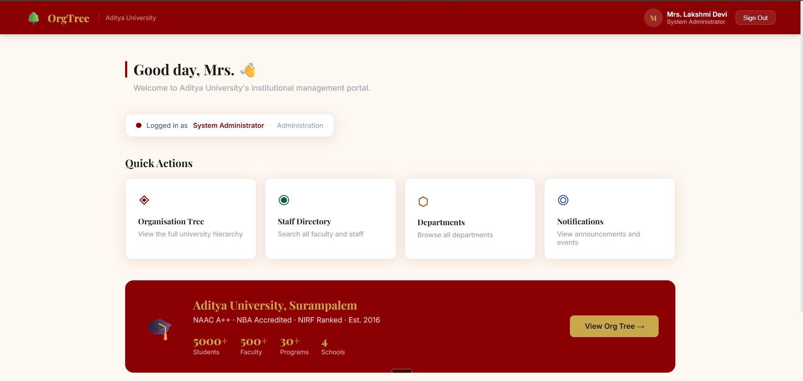
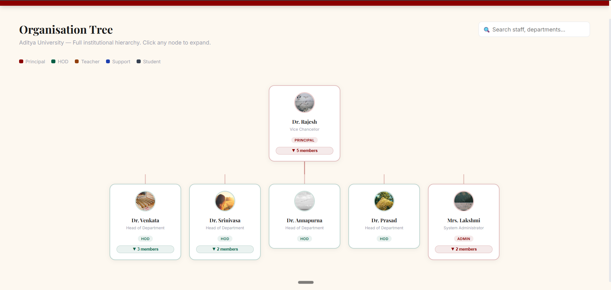
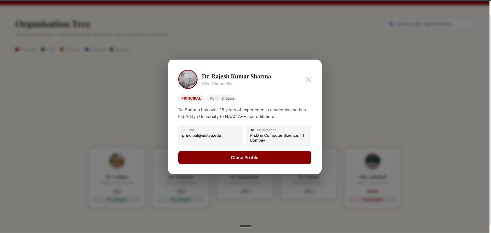
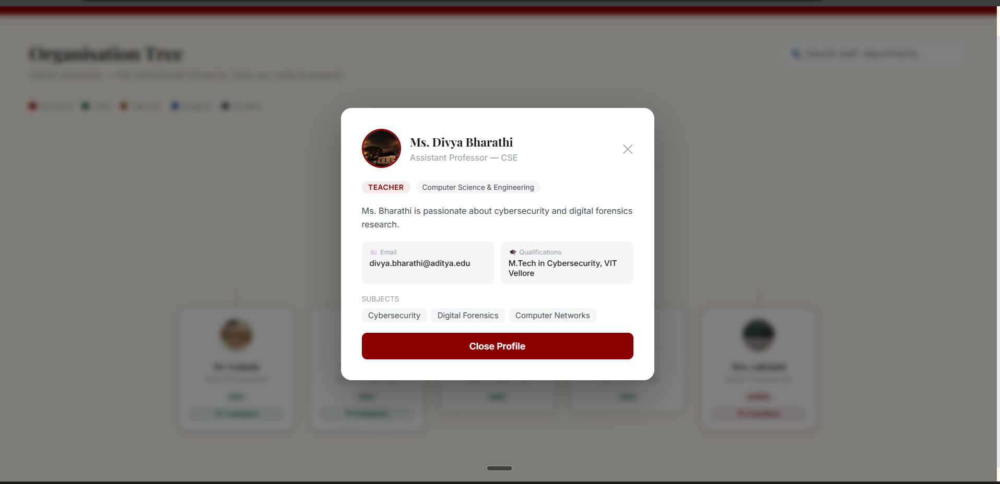

# 🌳 Organization Tree (OrgTree) - Aditya Educational Institutions

> A modern full-stack web application for visualizing and managing organizational hierarchies at Aditya Educational Institutions.



## 📋 Table of Contents

- [Overview](#overview)
- [Features](#features)
- [Tech Stack](#tech-stack)
- [Project Structure](#project-structure)
- [Getting Started](#getting-started)
- [Installation](#installation)
- [Usage](#usage)
- [Screenshots](#screenshots)
- [API Endpoints](#api-endpoints)
- [Security](#security)
- [Contributing](#contributing)
- [Support](#support)
- [License](#license)

---

## 🎯 Overview

OrgTree is a comprehensive organizational management system designed specifically for Aditya Educational Institutions. It provides an intuitive interface to:

- **Visualize** the complete organizational hierarchy
- **Manage** user authentication and roles
- **Explore** university departments and structure
- **Access** institutional information seamlessly

Whether you're an administrator, department head, or regular user, OrgTree makes organizational navigation simple and efficient.

---

## ✨ Features

### 🔐 Authentication & Authorization

- Secure JWT-based authentication
- Role-based access control
- Password encryption using bcryptjs
- Protected routes for sensitive data

### 📊 Organization Tree Visualization

- Interactive hierarchical tree structure
- Expandable/collapsible departments
- Real-time data updates
- Responsive design for all devices

### 👥 User Management

- User profile management
- Department assignments
- Role-based permissions
- User information display

### 📱 Responsive UI

- Mobile-first design
- Tablet and desktop optimization
- Modern React components
- Intuitive navigation

### 🏫 University Information

- Comprehensive institutional details
- Department listings
- Contact information
- Organizational news and updates

---

## 🛠️ Tech Stack

### Frontend

```
⚛️  React 19.2.4
🎨  Vite 8.0.1
🧭 React Router DOM 7.14.0
📡 Axios 1.14.0
✅ ESLint 9.39.4
```

### Backend

```
🚀 Node.js / Express.js 5.2.1
🗄️  MongoDB / Mongoose 9.4.1
🔑 JWT (jsonwebtoken 9.0.3)
🔐 bcryptjs 3.0.3
🚦 CORS 2.8.6
```

### Development Tools

```
📦 npm (Package Manager)
🔄 Nodemon (Auto-reload)
🔨 Vite (Build Tool)
```

---

## 📁 Project Structure

```
orgtree-aditya/
├── 📂 backend/
│   ├── 📄 server.js              # Express server entry point
│   ├── 📄 seed.js                # Database initialization
│   ├── 📂 config/
│   │   └── db.js                # MongoDB configuration
│   ├── 📂 controllers/
│   │   ├── authController.js    # Authentication logic
│   │   └── userController.js    # User management
│   ├── 📂 middleware/
│   │   └── authMiddleware.js    # Auth verification
│   ├── 📂 models/
│   │   └── User.js              # User schema
│   ├── 📂 routes/
│   │   ├── authRoutes.js        # Auth endpoints
│   │   └── userRoutes.js        # User endpoints
│   └── 📄 package.json
│
├── 📂 frontend/
│   ├── 📄 index.html            # HTML template
│   ├── 📂 src/
│   │   ├── 📄 main.jsx          # React entry point
│   │   ├── 📄 App.jsx           # Root component
│   │   ├── 📄 index.css         # Global styles
│   │   ├── 📂 components/
│   │   │   ├── Navbar.jsx       # Navigation
│   │   │   └── ProtectedRoute.jsx # Route guards
│   │   ├── 📂 context/
│   │   │   └── AuthContext.jsx  # Auth state
│   │   ├── 📂 pages/
│   │   │   ├── LandingPage.jsx  # Home page
│   │   │   ├── LoginPage.jsx    # Authentication
│   │   │   ├── Dashboard.jsx    # User dashboard
│   │   │   ├── OrgTree.jsx      # Tree visualization
│   │   │   └── UniversityPage.jsx # Institution info
│   │   └── 📂 assets/
│   ├── 📄 vite.config.js        # Vite configuration
│   ├── 📄 eslint.config.js      # ESLint rules
│   └── 📄 package.json
│
└── 📄 README.md
```

---

## 🚀 Getting Started

### Prerequisites

Before you begin, ensure you have installed:

- **Node.js** (v14.0 or higher) - [Download](https://nodejs.org/)
- **npm** (comes with Node.js) or **yarn**
- **MongoDB** (local or MongoDB Atlas) - [Setup Guide](https://www.mongodb.com/docs/manual/installation/)
- **Git** - [Download](https://git-scm.com/)

### Installation

#### 1. Clone the Repository

```bash
git clone https://github.com/aditya-edu/orgtree-aditya.git
cd orgtree-aditya
```

#### 2. Backend Setup

```bash
# Navigate to backend directory
cd backend

# Install dependencies
npm install

# Create .env file (example below)
# PORT=5000
# MONGODB_URI=mongodb://localhost:27017/orgtree
# JWT_SECRET=your_jwt_secret_key_here

# Initialize database with seed data
node seed.js

# Start development server
npm run dev
```

Backend will run on: `http://localhost:5000`

#### 3. Frontend Setup

```bash
# Navigate to frontend directory
cd ../frontend

# Install dependencies
npm install

# Start development server
npm run dev
```

Frontend will run on: `http://localhost:5173`

#### 4. Access the Application

Open your browser and visit: **http://localhost:5173**

---

## 📖 Usage

### User Login

1. Navigate to the **Login Page**
2. Enter your credentials
3. Click **Sign In**

### Explore Organization Tree

1. Go to **OrgTree** from navigation menu
2. View the hierarchical organization structure
3. Click on departments to expand/collapse

### View Dashboard

1. Access **Dashboard** after login
2. See your profile and assigned departments
3. Manage your account settings

### University Information

1. Visit **University Page**
2. Browse institutional details
3. Find contact information

---

## 📸 Screenshots

### Login Interface



### Dashboard Overview



### Navigation Bar



### Organization Tree Visualization



### Extended Organization Structure



### University Information Page



---

## 🔌 API Endpoints

### Authentication Routes

| Method | Endpoint             | Description       |
| ------ | -------------------- | ----------------- |
| POST   | `/api/auth/register` | Register new user |
| POST   | `/api/auth/login`    | User login        |
| POST   | `/api/auth/logout`   | User logout       |
| POST   | `/api/auth/refresh`  | Refresh JWT token |

### User Routes

| Method | Endpoint                   | Description                |
| ------ | -------------------------- | -------------------------- |
| GET    | `/api/users/profile`       | Get logged-in user profile |
| PUT    | `/api/users/profile`       | Update user profile        |
| GET    | `/api/users/org-structure` | Get organization tree      |
| GET    | `/api/users/:id`           | Get specific user          |
| PUT    | `/api/users/:id`           | Update user details        |

---

## 🔒 Security Features

### Authentication

- ✅ JWT token-based authentication
- ✅ Secure password hashing with bcryptjs
- ✅ Token expiration and refresh mechanism

### Authorization

- ✅ Role-based access control (RBAC)
- ✅ Protected API routes
- ✅ Protected React components

### Data Protection

- ✅ CORS (Cross-Origin Resource Sharing)
- ✅ Input validation
- ✅ Environment variable configuration
- ✅ Secure MongoDB connections

---

## 🤝 Contributing

We welcome contributions! Here's how you can help:

1. **Fork** the repository
2. **Create** a feature branch (`git checkout -b feature/AmazingFeature`)
3. **Commit** your changes (`git commit -m 'Add some AmazingFeature'`)
4. **Push** to the branch (`git push origin feature/AmazingFeature`)
5. **Open** a Pull Request

### Development Workflow

```bash
# Before committing, run linter
npm run lint

# Fix linting issues
npm run lint -- --fix
```

---

## 🐛 Reporting Issues

Found a bug? Please report it by:

1. Opening an [Issue](https://github.com/aditya-edu/orgtree-aditya/issues)
2. Providing clear description and steps to reproduce
3. Attaching screenshots if relevant

---

## 📧 Support & Contact

For questions, suggestions, or support:

- **Email**: admin@adityainstitutions.edu
- **Institution Website**: https://www.adityainstitutions.edu
- **GitHub Issues**: https://github.com/aditya-edu/orgtree-aditya/issues

---

## 📚 Documentation

- [Frontend Documentation](./frontend/README.md)
- [Backend Documentation](./backend/README.md)
- [API Documentation](./docs/API.md)
- [Deployment Guide](./docs/DEPLOYMENT.md)

---

## 📝 License

This project is licensed under the **ISC License**.

© 2026 Aditya Educational Institutions. All rights reserved.

---

## 🎓 Contributors

- **Project Lead**: Aditya Institutions
- **Frontend Developer**: Team Lead
- **Backend Developer**: Development Team
- **UI/UX Designer**: Design Team

---

## 📦 Dependencies

### Backend Dependencies

- `express` - Web framework
- `mongoose` - MongoDB ODM
- `jsonwebtoken` - JWT implementation
- `bcryptjs` - Password hashing
- `cors` - Cross-origin support
- `dotenv` - Environment configuration

### Frontend Dependencies

- `react` - UI library
- `vite` - Build tool
- `react-router-dom` - Routing
- `axios` - HTTP client

---

## 🚀 Performance Tips

1. **Lazy Loading**: Components are code-split for faster initial load
2. **Caching**: API responses are cached on the client side
3. **Compression**: Assets are minified in production
4. **Database Indexing**: MongoDB indexes optimize queries

---

## 🔄 Version History

| Version | Date     | Changes           |
| ------- | -------- | ----------------- |
| 1.0.0   | Apr 2026 | Initial release   |
| 0.9.0   | Mar 2026 | Beta testing      |
| 0.5.0   | Jan 2026 | Development phase |

---

## 🙌 Acknowledgments

Special thanks to:

- The React and Node.js communities
- Aditya Educational Institutions
- All contributors and testers

---

**Last Updated**: April 6, 2026

**Status**: ✅ Active Development

**Maintenance**: 🔧 Actively Maintained

---

> Made with ❤️ for Aditya Educational Institutions
